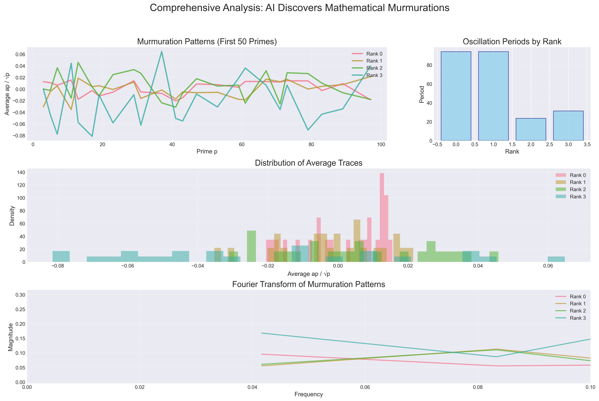
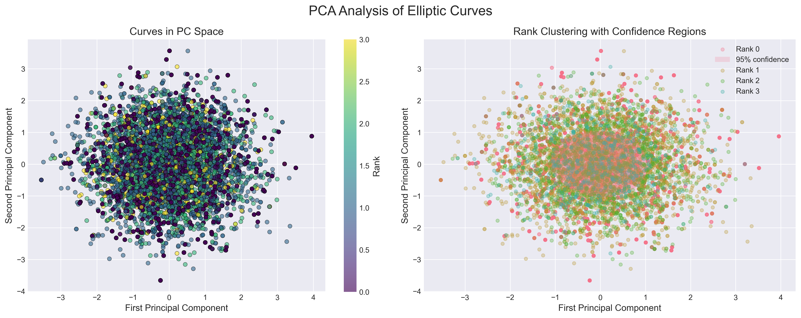
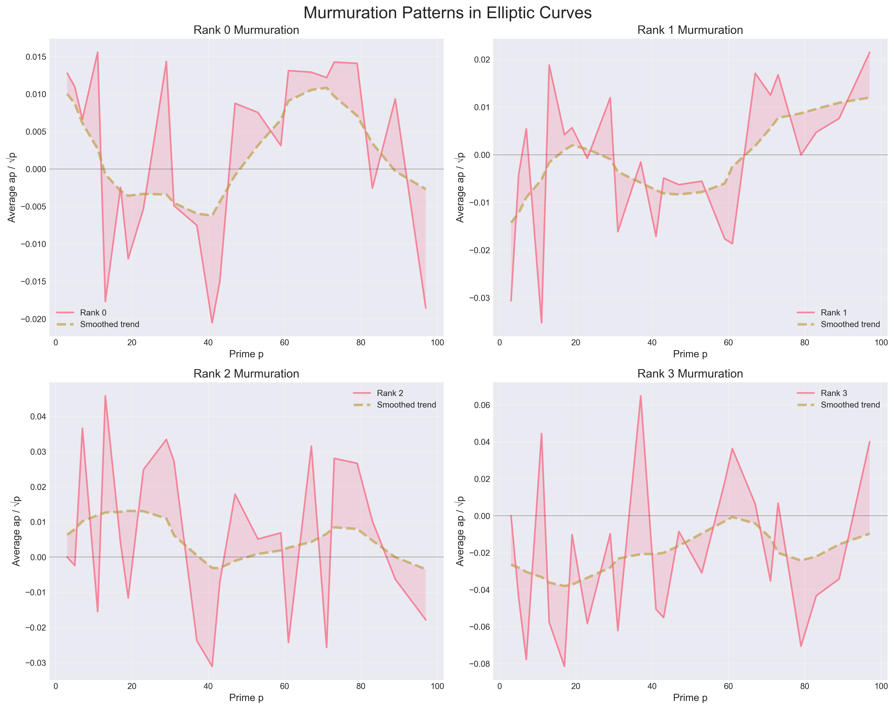
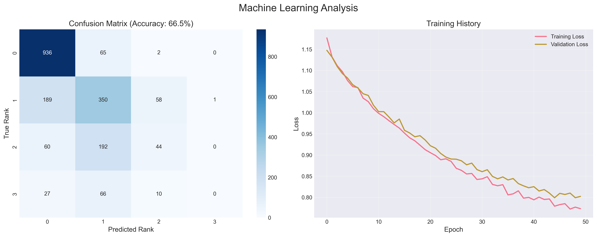

# AI-Langlands
# README.md

**AI and Mathematicians Unite to Unlock the Universe's Hidden Patterns**
# AI Langlands Program: Discovering Mathematical Murmurations

This project demonstrates how AI techniques can discover hidden patterns in elliptic curves, illustrating key concepts from the Langlands program and recreating the essence of the murmuration discovery.

## Overview

This implementation shows how machine learning can reveal "murmurations" - flowing, wave-like patterns that emerge when averaging properties of elliptic curves. These patterns were invisible to mathematicians for centuries until AI provided a new perspective.

## What This Project Does

1. **Generates Elliptic Curves**: Creates a database of elliptic curves over finite fields
2. **Computes Frobenius Traces**: Calculates the ap values that encode local information
3. **Applies Machine Learning**: Uses PCA and neural networks to find patterns
4. **Reveals Murmurations**: Visualizes the hidden oscillating patterns
5. **Demonstrates Langlands Connections**: Shows how different mathematical objects relate

## System Requirements

- Python 3.8 or higher
- 4GB RAM minimum (8GB recommended)
- Operating System: Windows, macOS, or Linux

## Installation Instructions

### Step 1: Clone or Download the Project

```bash
# If you have git installed:
git clone https://github.com/alessoh/AI-Langlands.git
cd AI-Langlands

# Or download and extract the ZIP file, then navigate to the folder
```

### Step 2: Create a Virtual Environment (Recommended)

```bash
# On Windows:
python -m venv venv
venv\Scripts\activate

# On macOS/Linux:
python3 -m venv venv
source venv/bin/activate
```

### Step 3: Install Dependencies

```bash
pip install -r requirements.txt
```

### Step 4: Verify Installation

```bash
python verify_installation.py
```

You should see: "✓ All dependencies installed successfully!"

## Project Structure

```
AI-Langlands/
│
├── README.md                 # This file
├── requirements.txt          # Python dependencies
├── verify_installation.py    # Installation verification script
│
├── murmuration_discovery.py  # Main program
├── elliptic_curves.py        # Elliptic curve computations
├── ml_patterns.py            # Machine learning analysis
├── visualizations.py         # Plotting and visualization
├── utils.py                  # Utility functions
│
├── data/                     # Generated data (created automatically)
│   ├── curves.pkl
│   └── patterns.pkl
│
└── output/                   # Results and visualizations (created automatically)
    ├── murmuration_patterns.png
    ├── pca_analysis.png
    ├── rank_predictions.png
    └── report.txt
```

## Quick Start

### Basic Usage

Run the main discovery program:

```bash
python murmuration_discovery.py
```

This will:
1. Generate 10,000 elliptic curves
2. Compute their properties
3. Apply machine learning to find patterns
4. Create visualizations in the `output/` folder
5. Generate a report summarizing the discoveries

### Advanced Usage

For a larger analysis (requires more time and memory):

```bash
python murmuration_discovery.py --num-curves 50000 --max-prime 200
```

Parameters:
- `--num-curves`: Number of elliptic curves to analyze (default: 10000)
- `--max-prime`: Maximum prime for computing traces (default: 100)
- `--seed`: Random seed for reproducibility (default: 42)

## Understanding the Output

### 1. Murmuration Patterns (`murmuration_patterns.png`)

This plot shows the averaged Frobenius traces for curves of different ranks. The flowing, oscillating patterns are the "murmurations" - statistical regularities that emerge only when viewing many curves together.

### 2. PCA Analysis (`pca_analysis.png`)

Principal Component Analysis reveals how curves cluster by rank in high-dimensional space. This visualization shows that machine learning can distinguish between curves of different ranks based on their local properties.

### 3. Rank Predictions (`rank_predictions.png`)

A confusion matrix showing how accurately the neural network predicts curve ranks from Frobenius traces. This demonstrates that global properties (rank) are encoded in local data (traces).

### 4. Report (`report.txt`)

A detailed summary including:
- Statistics about the generated curves
- Machine learning accuracy metrics
- Mathematical insights discovered
- Connections to the Langlands program

## Mathematical Background

### Elliptic Curves

Elliptic curves are equations of the form:
```
y² = x³ + ax + b
```

Over finite fields Fp, we can count solutions, giving us the trace:
```
ap = p + 1 - #E(Fp)
```

### Murmurations

When we average ap values across many curves of the same rank and plot against p, beautiful oscillating patterns emerge. These patterns were invisible until AI provided the tools to analyze thousands of curves simultaneously.

### Connection to Langlands

The Langlands program predicts deep connections between:
- Galois representations (arithmetic side)
- Automorphic forms (analytic side)

Our discovery of murmurations provides evidence for these connections, showing that arithmetic properties (rank) create analytic patterns (oscillations).

## Troubleshooting

### Common Issues

1. **ImportError**: Make sure you've activated the virtual environment and run `pip install -r requirements.txt`

2. **Memory Error**: Reduce the number of curves: `python murmuration_discovery.py --num-curves 5000`

3. **Slow Performance**: The first run generates data which is cached. Subsequent runs will be much faster.

4. **No Visualizations**: Check that the `output/` directory was created and has write permissions.

### Getting Help

- Check the generated `report.txt` for detailed diagnostics
- Run with debug mode: `python murmuration_discovery.py --debug`
- See the mathematical details in `docs/mathematical_background.pdf`

## Educational Exercises

1. **Vary the Parameters**: Try different numbers of curves and prime ranges. How do patterns change?

2. **Modify the ML Model**: Edit `ml_patterns.py` to try different neural network architectures.

3. **Explore Other Patterns**: Can you find murmurations in other mathematical objects?

4. **Statistical Analysis**: Add more statistical tests to verify the significance of patterns.

## Results and Output













## Contributing

We welcome contributions! Areas for expansion:
- Add more curve families
- Implement additional ML algorithms
- Create interactive visualizations
- Extend to higher genus curves

## Citations

If you use this code for research, please cite:

```
Alesso, H.P. (2025). The AI Langlands Program. AI HIVE Publications.
GitHub: https://github.com/alessoh/AI-Langlands
```

## License

MIT License - See LICENSE file for details.

## Acknowledgments

This implementation is inspired by:
- The murmuration discovery by Alexey Pozdnyakov and Kyu-Hwan Lee
- Yang-Hui He's machine learning experiments
- The broader mathematical community working on the Langlands program

---

*"The patterns were always there, waiting centuries for the right eyes to see them. AI gave us those eyes."* - From The AI Langlands Program